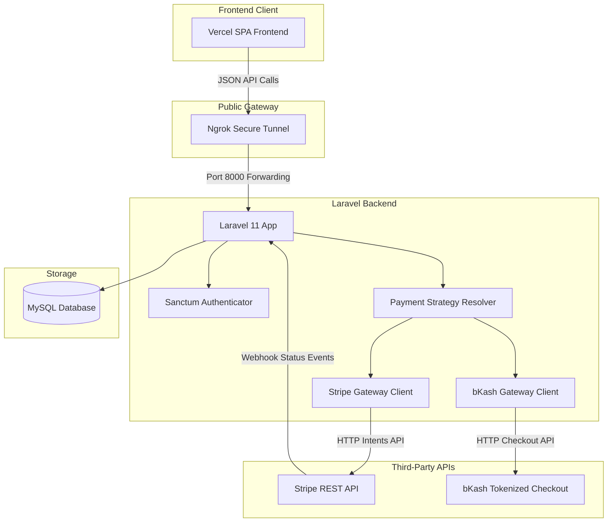
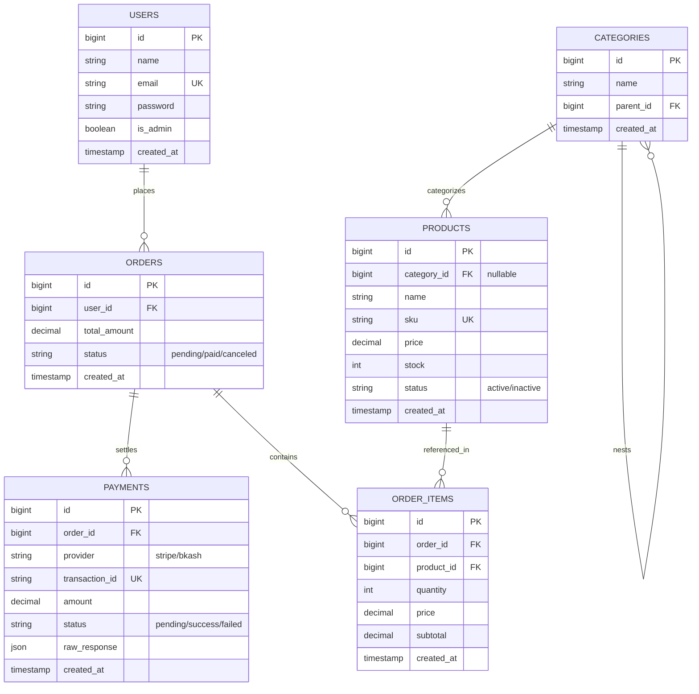
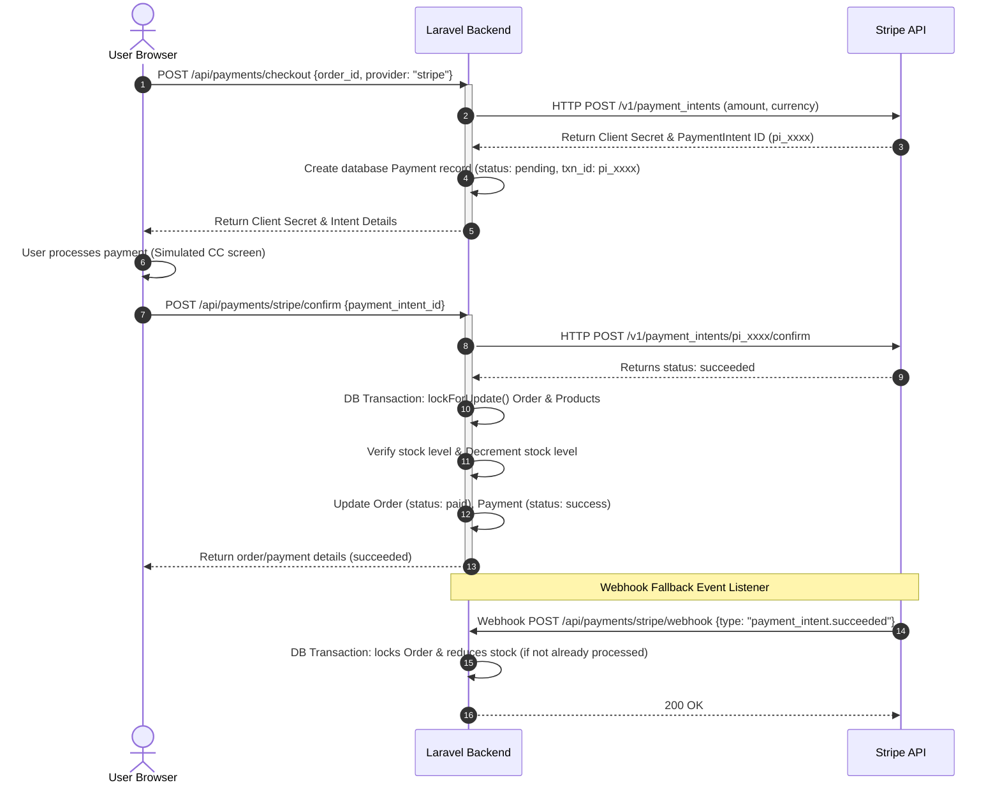
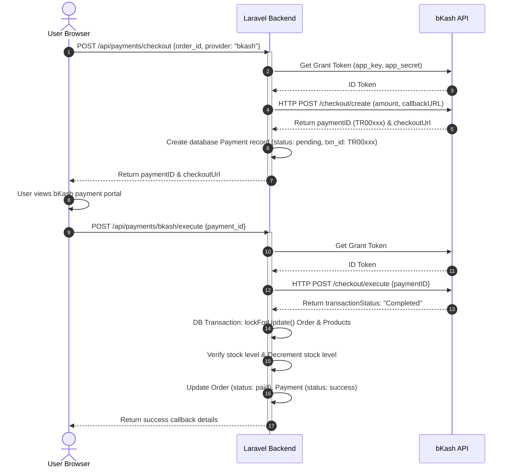

# GlowCommerce - E-Commerce Platform Backend

Welcome to the **GlowCommerce** repository. Below is the comprehensive system documentation, architecture diagrams, ERDs, API references, payment flows, and deployment guides required for your job assessment.

---

## 1. System Architecture



---

## 2. Entity Relationship Diagram (ERD)



---

## 3. Payment Flows

### 3.1 Stripe Integration Flow


### 3.2 bKash Integration Flow


---

## 4. API Endpoints Documentation

All requests should carry headers:
```http
Content-Type: application/json
Accept: application/json
Authorization: Bearer <your_access_token> (Required for protected routes)
```

| Method | Endpoint | Protection | Description |
| :--- | :--- | :--- | :--- |
| `POST` | `/api/register` | Public | Registers a new account. Returns Bearer token. |
| `POST` | `/api/login` | Public | Logs in a user. Returns Bearer token. |
| `POST` | `/api/user/toggle-admin` | Auth | Developer helper to switch user role (Customer <-> Admin). |
| `GET` | `/api/products` | Public | Lists all active products. Admins see active & inactive. |
| `GET` | `/api/products/{id}` | Public | Details of a single product. Inactive is restricted to admin. |
| `POST` | `/api/products` | Admin | Create a new product. SKU must be unique. |
| `PUT` | `/api/products/{id}` | Admin | Edit an existing product. |
| `DELETE` | `/api/products/{id}` | Admin | Delete a product. |
| `POST` | `/api/orders` | Auth | Place an order. Calculates subtotals/totals deterministically. |
| `GET` | `/api/orders/{id}` | Auth | View order details. Enforces ownership check. |
| `GET` | `/api/orders` | Auth | Lists the user's placed orders (paginated). |
| `GET` | `/api/payments` | Auth | Lists user's ledger of payment transactions. |
| `POST` | `/api/payments/checkout` | Auth | Initiates provider checkouts (Stripe/bKash). |
| `POST` | `/api/payments/stripe/confirm` | Auth | Confirms Stripe payment & runs safe stock reduction. |
| `POST` | `/api/payments/stripe/webhook` | Public | Stripe status update webhook handler. |
| `POST` | `/api/payments/bkash/execute` | Auth | Executes bKash checkout & runs safe stock reduction. |
| `GET` | `/api/payments/bkash/query/{id}` | Auth | Queries status of bKash transaction. |

---

## 5. Deployment Guide

### 5.1 Local Installation
1. Clone the repository and navigate into it:
   ```bash
   composer install
   copy .env.example .env
   php artisan key:generate
   ```
2. Configure `.env` file settings:
   - Database credentials (`DB_DATABASE=ecommerce`, `DB_USERNAME=root`, `DB_PASSWORD=`).
   - Payment credentials (keys for Stripe / bKash).
3. Run migrations and database seeders:
   ```bash
   php artisan migrate --seed
   ```
   *(Creates: admin account: `admin@example.com`, customer: `customer@example.com` - passwords are `secret123`)*.
4. Launch local dev server:
   ```bash
   php artisan serve
   ```
5. Visit `http://127.0.0.1:8000` in your web browser.

